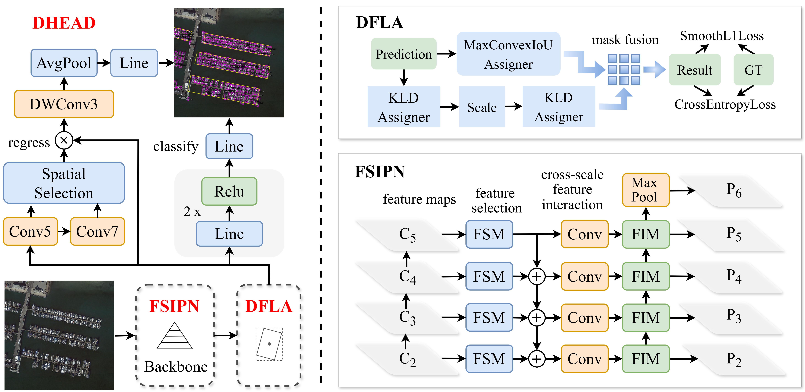
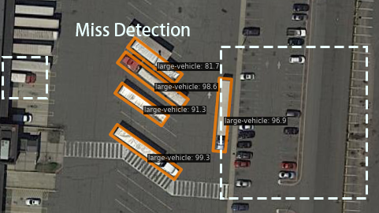
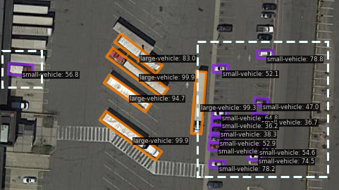
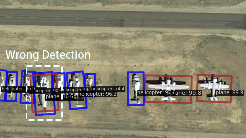
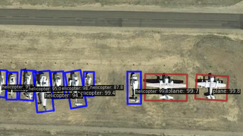
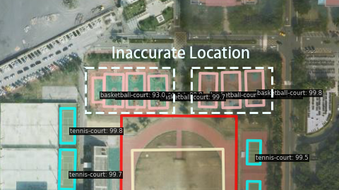
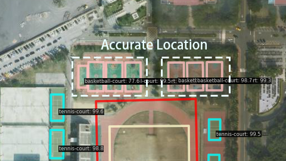
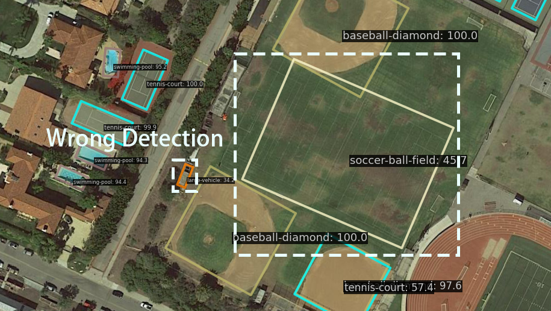
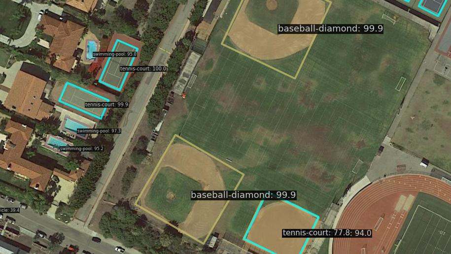

# DFLAN
The code will be made public after the paper is accepted.

## Introduction

Dynamic Fusion Label Assignment Network (DFLAN) is a new two-stage detection algorithm focusing on high-precision remote sensing object detection.

__Abstract:__ Remote sensing object detection lacks research on
cross-scale feature fusion, label assignment strategies, and proposal refinement. In this paper, we
proposes a novel two-stage detection algorithm,
called Dynamic Fusion Label Assignment Network
(DFLAN), focusing on high-precision oriented object detection in remote sensing. Firstly, to improve feature selection and cross-layer feature interaction capabilities, we propose a new Feature
Selection Interaction Pyramid Network (FSIPN).
Additionally, we introduce a novel Dynamic Fusion Label Assignment (DFLA), which synergistically combines IoU and KLD (Kullback-Leibler
Divergence) to address the challenges in assigning labels to both large and small objects effectively. Thirdly, to achieve more accurate proposal refinement results, we propose a new Decouple Head (DHEAD), which decouples classification and regression tasks while dynamically adjusting the IoU threshold. Without tricks, DFLAN
achieves state-of-the-art detection accuracy on two
commonly-used datasets for oriented object detection including DOTA-v1.0 (79.35% mAP) and
HRSC2016 (98.86% mAP).

## Qualitative Results

https://github.com/user-attachments/assets/27b916da-4ab2-4876-abb7-29923feacb1f

Visual results on DOTA-v1.0 dataset.

| **LSKNet(baseline)**                       | **DFLAN(ours)**                       |
|----------------------------------|----------------------------------|
|  |  |
|  |  |
|  |  |
|  |  |
